# Database Model - RealSaveFooding MVP

## 1. Domain Analysis

### Identified entities and responsibilities

1. USER
- Represents an authenticated person using the app.
- Owns security credentials and profile identity.
- Can belong to one or more shared households.

2. HOUSEHOLD
- Represents a shared pantry boundary.
- Groups users, pantry items, and shared inventory behavior.

3. HOUSEHOLD_MEMBER
- Junction entity between USER and HOUSEHOLD.
- Stores membership role and status for access decisions.

4. HOUSEHOLD_INVITATION
- Manages invitation lifecycle (pending, accepted, revoked, expired).
- Enables controlled onboarding of a second user into a shared household.

5. PANTRY_ITEM
- Represents each tracked food item instance.
- Stores quantity, estimated/confirmed expiry, and ownership context.

6. RECEIPT
- Represents uploaded receipt metadata and storage reference.
- Tracks OCR processing state and ownership context.

7. RECEIPT_ITEM
- Represents line items extracted from receipts.
- Supports review and mapping to pantry items.

8. EXPIRATION_ASSESSMENT
- Stores expiry estimation and confidence metadata per pantry item.
- Keeps auditable distinction between estimated vs user-confirmed expiry.

9. CONSUMPTION_EVENT
- Event log for consumed/wasted actions.
- Supports waste analytics and actor traceability.

10. NOTIFICATION_PREFERENCE
- Stores per-user alert configuration.
- Supports expiry and shared-consumption notification controls.

11. USER_POINTS
- Ledger of gamification point deltas (earned/deducted) per user.
- Drives the total-points counter shown in the gamification summary.

12. USER_BADGE
- Achievement badges earned by a user.
- Enforces one award per (user, badge code) pair.

13. AUTO_EXPIRY_DIGEST
- Tracks consumption-automation digests sent to users for long-expired items.
- Records send and resolution timestamps for the automation workflow.

14. NOTIFICATION_LOG
- Delivery audit log for outbound email/push notifications.
- Captures channel, status, and failure reason for observability.

15. PUSH_SUBSCRIPTION
- Stores Web Push subscription credentials (endpoint + keys) per user.
- One active subscription per user for browser push delivery.

16. USER_CATEGORY_EXPIRY_PREFERENCE
- Learned per-user, per-category expiry offset derived from confirmed overrides.
- Feeds back into future expiration suggestions (expiry-learning automation).

## 2. Mermaid ER Diagram

```mermaid
erDiagram
    USER ||--o{ HOUSEHOLD_MEMBER : joins
    HOUSEHOLD ||--o{ HOUSEHOLD_MEMBER : has

    HOUSEHOLD ||--o{ HOUSEHOLD_INVITATION : issues
    USER ||--o{ HOUSEHOLD_INVITATION : sends

    HOUSEHOLD ||--o{ PANTRY_ITEM : contains
    USER ||--o{ PANTRY_ITEM : created_by

    HOUSEHOLD ||--o{ RECEIPT : owns
    USER ||--o{ RECEIPT : uploaded_by

    RECEIPT ||--o{ RECEIPT_ITEM : contains
    PANTRY_ITEM ||--o| EXPIRATION_ASSESSMENT : has

    PANTRY_ITEM ||--o{ CONSUMPTION_EVENT : records
    USER ||--o{ CONSUMPTION_EVENT : performs

    USER ||--o| NOTIFICATION_PREFERENCE : configures

    USER ||--o{ USER_POINTS : accrues
    USER ||--o{ USER_BADGE : earns
    USER ||--o{ AUTO_EXPIRY_DIGEST : receives
    USER ||--o{ NOTIFICATION_LOG : logs
    USER ||--o| PUSH_SUBSCRIPTION : registers
    USER ||--o{ USER_CATEGORY_EXPIRY_PREFERENCE : learns

    %% PRICE_CATALOG_ITEM is a standalone reference dataset, matched by normalized_name
    %% at query time — no FK relationship to any other entity.

    USER {
        uuid id PK
        text email UK
        text password_hash
        text full_name
        timestamptz created_at
        timestamptz updated_at
        timestamptz deleted_at
    }

    HOUSEHOLD {
        uuid id PK
        text name
        uuid created_by_user_id FK
        timestamptz created_at
        timestamptz updated_at
    }

    HOUSEHOLD_MEMBER {
        uuid id PK
        uuid household_id FK
        uuid user_id FK
        text role
        text status
        timestamptz joined_at
        timestamptz left_at
    }

    HOUSEHOLD_INVITATION {
        uuid id PK
        uuid household_id FK
        uuid invited_by_user_id FK
        text invitee_email
        text status
        timestamptz expires_at
        timestamptz responded_at
        timestamptz created_at
    }

    PANTRY_ITEM {
        uuid id PK
        uuid household_id FK
        uuid created_by_user_id FK
        text name
        text normalized_name
        numeric quantity
        text quantity_unit
        date purchase_date
        date expiration_date
        text expiration_source
        text status
        timestamptz created_at
        timestamptz updated_at
    }

    RECEIPT {
        uuid id PK
        uuid household_id FK
        uuid uploaded_by_user_id FK
        text storage_bucket
        text storage_key
        timestamptz purchased_at
        text ocr_status
        timestamptz processed_at
        timestamptz created_at
    }

    RECEIPT_ITEM {
        uuid id PK
        uuid receipt_id FK
        uuid pantry_item_id FK
        text raw_name
        text normalized_name
        numeric quantity
        text quantity_unit
        numeric unit_price_eur
        numeric line_total_eur
        boolean user_confirmed
        timestamptz created_at
    }

    EXPIRATION_ASSESSMENT {
        uuid id PK
        uuid pantry_item_id FK
        date suggested_expiration_date
        numeric confidence
        text method
        boolean user_confirmed
        uuid confirmed_by_user_id FK
        timestamptz created_at
    }

    CONSUMPTION_EVENT {
        uuid id PK
        uuid pantry_item_id FK
        uuid actor_user_id FK
        text event_type
        numeric quantity
        numeric estimated_value_eur
        text notes
        timestamptz event_at
    }

    NOTIFICATION_PREFERENCE {
        uuid id PK
        uuid user_id FK
        boolean expiry_alert_enabled
        boolean consumption_alert_enabled
        boolean price_drop_alert_enabled
        integer expiry_threshold_days
        timestamptz updated_at
    }

    USER_POINTS {
        uuid id PK
        uuid user_id FK
        integer delta
        text reason
        text reference_id
        timestamptz occurred_at
    }

    USER_BADGE {
        uuid id PK
        uuid user_id FK
        text code
        timestamptz earned_at
    }

    AUTO_EXPIRY_DIGEST {
        uuid id PK
        uuid user_id FK
        timestamptz sent_at
        timestamptz resolved_at
        text status
    }

    NOTIFICATION_LOG {
        uuid id PK
        uuid user_id FK
        text type
        text channel
        text status
        text fail_reason
        timestamptz sent_at
    }

    PUSH_SUBSCRIPTION {
        uuid id PK
        uuid user_id FK
        text endpoint
        text p256dh
        text auth
        timestamptz created_at
    }

    USER_CATEGORY_EXPIRY_PREFERENCE {
        uuid id PK
        uuid user_id FK
        text category
        float deltas
        float average_delta
        integer sample_count
        timestamptz updated_at
    }

    PRICE_CATALOG_ITEM {
        uuid id PK
        text normalized_name
        text category
        text supermarket
        decimal reference_price_eur
        text currency_code
        date effective_date
        text source_label
        timestamptz created_at
    }
```



## 3. Entity Definitions

### USER
- Purpose: Account identity and authentication principal.
- Attributes: id, email, password_hash, full_name, created_at, updated_at, deleted_at.
- PK: id.
- FKs: none.
- Constraints:
  - email NOT NULL, unique, case-insensitive unique index on lower(email).
  - password_hash NOT NULL.
- Relationships:
  - One USER to many HOUSEHOLD_MEMBER.
  - One USER to many PANTRY_ITEM (creator).
  - One USER to many RECEIPT (uploader).
  - One USER to one NOTIFICATION_PREFERENCE.

### HOUSEHOLD
- Purpose: Shared pantry boundary for multiple users.
- Attributes: id, name, created_by_user_id, created_at, updated_at.
- PK: id.
- FKs: created_by_user_id -> USER.id.
- Constraints:
  - name NOT NULL.
- Relationships:
  - One HOUSEHOLD to many HOUSEHOLD_MEMBER.
  - One HOUSEHOLD to many PANTRY_ITEM.
  - One HOUSEHOLD to many RECEIPT.
  - One HOUSEHOLD to many HOUSEHOLD_INVITATION.

### HOUSEHOLD_MEMBER
- Purpose: Membership and authorization context.
- Attributes: id, household_id, user_id, role, status, joined_at, left_at.
- PK: id.
- FKs:
  - household_id -> HOUSEHOLD.id
  - user_id -> USER.id
- Constraints:
  - unique(household_id, user_id).
  - role CHECK in (OWNER, MEMBER).
  - status CHECK in (ACTIVE, LEFT, REMOVED).
- Relationships:
  - Many HOUSEHOLD_MEMBER to one USER.
  - Many HOUSEHOLD_MEMBER to one HOUSEHOLD.

### HOUSEHOLD_INVITATION
- Purpose: Controlled invite flow for sharing.
- Attributes: id, household_id, invited_by_user_id, invitee_email, status, expires_at, responded_at, created_at.
- PK: id.
- FKs:
  - household_id -> HOUSEHOLD.id
  - invited_by_user_id -> USER.id
- Constraints:
  - status CHECK in (PENDING, ACCEPTED, REVOKED, EXPIRED).
  - invitee_email NOT NULL.
- Relationships:
  - Many invitations per household.
  - Many invitations per inviter user.

### PANTRY_ITEM
- Purpose: Core inventory unit tracked by users.
- Attributes: id, household_id, created_by_user_id, name, normalized_name, quantity, quantity_unit, purchase_date, expiration_date, expiration_source, status, created_at, updated_at.
- PK: id.
- FKs:
  - household_id -> HOUSEHOLD.id
  - created_by_user_id -> USER.id
- Constraints:
  - quantity > 0.
  - status CHECK in (FRESH, EXPIRING_SOON, EXPIRED, CONSUMED, WASTED).
  - expiration_source CHECK in (USER, OCR_ESTIMATE).
- Relationships:
  - One PANTRY_ITEM to many CONSUMPTION_EVENT.
  - One PANTRY_ITEM to zero or one EXPIRATION_ASSESSMENT.

### RECEIPT
- Purpose: Receipt ingestion metadata and processing state.
- Attributes: id, household_id, uploaded_by_user_id, storage_bucket, storage_key, purchased_at, ocr_status, processed_at, created_at.
- PK: id.
- FKs:
  - household_id -> HOUSEHOLD.id
  - uploaded_by_user_id -> USER.id
- Constraints:
  - ocr_status CHECK in (PENDING, PROCESSING, COMPLETED, FAILED).
  - storage_key NOT NULL.
- Relationships:
  - One RECEIPT to many RECEIPT_ITEM.

### RECEIPT_ITEM
- Purpose: OCR-extracted line item plus user confirmation fields.
- Attributes: id, receipt_id, pantry_item_id, raw_name, normalized_name, quantity, quantity_unit, unit_price_eur, line_total_eur, user_confirmed, created_at.
- PK: id.
- FKs:
  - receipt_id -> RECEIPT.id
  - pantry_item_id -> PANTRY_ITEM.id (nullable until mapping confirmed)
- Constraints:
  - quantity > 0 when provided.
  - unit_price_eur >= 0, line_total_eur >= 0.
- Relationships:
  - Many RECEIPT_ITEM to one RECEIPT.
  - Many RECEIPT_ITEM optionally map to one PANTRY_ITEM.

### EXPIRATION_ASSESSMENT
- Purpose: Audit trail of estimated expiry and confidence.
- Attributes: id, pantry_item_id, suggested_expiration_date, confidence, method, user_confirmed, confirmed_by_user_id, created_at.
- PK: id.
- FKs:
  - pantry_item_id -> PANTRY_ITEM.id
  - confirmed_by_user_id -> USER.id (nullable)
- Constraints:
  - unique(pantry_item_id) for MVP single active assessment.
  - confidence between 0 and 1.
  - method CHECK in (RULE_BASED_SPAIN, MANUAL_OVERRIDE).
- Relationships:
  - One EXPIRATION_ASSESSMENT to one PANTRY_ITEM.

### CONSUMPTION_EVENT
- Purpose: Event-based tracking of consumed/wasted quantities and value.
- Attributes: id, pantry_item_id, actor_user_id, event_type, quantity, estimated_value_eur, notes, event_at.
- PK: id.
- FKs:
  - pantry_item_id -> PANTRY_ITEM.id
  - actor_user_id -> USER.id
- Constraints:
  - event_type CHECK in (CONSUMED, WASTED, SUGGESTED_WASTE, CONFIRMED_WASTE).
  - quantity > 0.
  - estimated_value_eur >= 0.
- Relationships:
  - Many events per pantry item.
  - Many events per user.

### NOTIFICATION_PREFERENCE
- Purpose: User-level notification policy.
- Attributes: id, user_id, expiry_alert_enabled, consumption_alert_enabled, price_drop_alert_enabled, expiry_threshold_days, updated_at.
- PK: id.
- FKs:
  - user_id -> USER.id
- Constraints:
  - unique(user_id).
  - expiry_threshold_days >= 1.
- Relationships:
  - One preference record per user.

### USER_POINTS
- Purpose: Ledger of gamification point deltas per user.
- Attributes: id, user_id, delta, reason, reference_id, occurred_at.
- PK: id.
- FKs: user_id -> USER.id.
- Relationships:
  - Many ledger rows per user.

### USER_BADGE
- Purpose: Achievement badges earned by a user.
- Attributes: id, user_id, code, earned_at.
- PK: id.
- FKs: user_id -> USER.id.
- Constraints:
  - unique(user_id, code).
- Relationships:
  - Many badges per user.

### AUTO_EXPIRY_DIGEST
- Purpose: Consumption-automation digest tracking for long-expired items.
- Attributes: id, user_id, sent_at, resolved_at, status.
- PK: id.
- FKs: user_id -> USER.id.
- Relationships:
  - Many digests per user.

### NOTIFICATION_LOG
- Purpose: Delivery audit log for outbound email/push notifications.
- Attributes: id, user_id, type, channel, status, fail_reason, sent_at.
- PK: id.
- FKs: user_id -> USER.id.
- Relationships:
  - Many log entries per user.

### PUSH_SUBSCRIPTION
- Purpose: Web Push subscription credentials for browser push delivery.
- Attributes: id, user_id, endpoint, p256dh, auth, created_at.
- PK: id.
- FKs: user_id -> USER.id.
- Constraints:
  - unique(user_id).
- Relationships:
  - One subscription per user.

### USER_CATEGORY_EXPIRY_PREFERENCE
- Purpose: Learned per-user, per-category expiry offset used to auto-adjust future expiration suggestions.
- Attributes: id, user_id, category, deltas, average_delta, sample_count, updated_at.
- PK: id.
- FKs: user_id -> USER.id.
- Constraints:
  - unique(user_id, category).
- Relationships:
  - Many preference rows per user.

### PRICE_CATALOG_ITEM
- Purpose: Manually curated reference price for a product at a given Spanish supermarket
  chain, used by the price-comparison feature (EXT-011). No live/external price
  integration is used — see EXT-011 for rationale.
- Attributes: id, normalized_name, category, supermarket, reference_price_eur,
  currency_code, effective_date, source_label, created_at.
- PK: id.
- FKs: none (not user-scoped; a shared reference dataset).
- Constraints:
  - reference_price_eur >= 0.
- Relationships:
  - None to other entities; matched against PANTRY_ITEM/RECEIPT_ITEM at query time by
    normalized_name, one row per (normalized_name, supermarket, effective_date).
- Index: (normalized_name, supermarket, effective_date) — latest effective_date per
  supermarket is selected at read time.

## 4. Normalization Review

### 1NF
- All entities use atomic attributes.
- No repeating groups in any row.
- Multi-valued concepts (memberships, receipt lines, events) are separated into dedicated tables.

### 2NF
- Surrogate primary keys avoid partial dependency issues.
- In associative entities (HOUSEHOLD_MEMBER), non-key attributes depend on the full business key (household and user membership), enforced by unique constraint.

### 3NF
- Non-key attributes depend only on the key of their table.
- Derived/transient concerns are separated:
  - Receipt metadata in RECEIPT, line-level data in RECEIPT_ITEM.
  - Expiry confidence metadata in EXPIRATION_ASSESSMENT instead of PANTRY_ITEM.
  - Event history in CONSUMPTION_EVENT rather than denormalized counters in PANTRY_ITEM.

### Trade-offs
- PANTRY_ITEM.status can be derived from dates and events, but persisted for fast mobile reads and dashboards.

## 5. Index Strategy (PostgreSQL SQL Recommendations)

```sql
-- USER
CREATE UNIQUE INDEX ux_user_email_lower ON "user" (LOWER(email));

-- FK indexes (PostgreSQL does not auto-create indexes for FKs)
CREATE INDEX ix_household_created_by_user_id ON household (created_by_user_id);
CREATE INDEX ix_household_member_household_id ON household_member (household_id);
CREATE INDEX ix_household_member_user_id ON household_member (user_id);
CREATE INDEX ix_household_invitation_household_id ON household_invitation (household_id);
CREATE INDEX ix_household_invitation_invited_by_user_id ON household_invitation (invited_by_user_id);
CREATE INDEX ix_pantry_item_household_id ON pantry_item (household_id);
CREATE INDEX ix_pantry_item_created_by_user_id ON pantry_item (created_by_user_id);
CREATE INDEX ix_receipt_household_id ON receipt (household_id);
CREATE INDEX ix_receipt_uploaded_by_user_id ON receipt (uploaded_by_user_id);
CREATE INDEX ix_receipt_item_receipt_id ON receipt_item (receipt_id);
CREATE INDEX ix_receipt_item_pantry_item_id ON receipt_item (pantry_item_id);
CREATE INDEX ix_expiration_assessment_pantry_item_id ON expiration_assessment (pantry_item_id);
CREATE INDEX ix_expiration_assessment_confirmed_by_user_id ON expiration_assessment (confirmed_by_user_id);
CREATE INDEX ix_consumption_event_pantry_item_id ON consumption_event (pantry_item_id);
CREATE INDEX ix_consumption_event_actor_user_id ON consumption_event (actor_user_id);
CREATE INDEX ix_notification_preference_user_id ON notification_preference (user_id);

-- Access-path indexes for common MVP queries
CREATE INDEX ix_pantry_item_household_status_expiration
  ON pantry_item (household_id, status, expiration_date);

CREATE INDEX ix_consumption_event_item_event_at
  ON consumption_event (pantry_item_id, event_at DESC);

CREATE INDEX ix_receipt_household_created_at
  ON receipt (household_id, created_at DESC);

-- Partial index for expiring workflow
CREATE INDEX ix_pantry_item_expiring_active
  ON pantry_item (household_id, expiration_date)
  WHERE status IN ('FRESH', 'EXPIRING_SOON');

-- Invitation lookup by email/status
CREATE INDEX ix_household_invitation_email_status
  ON household_invitation (LOWER(invitee_email), status);
```

### Index rationale
- FK indexes prevent delete/update lock amplification and speed joins.
- Composite indexes reflect primary mobile read paths: pantry list, expiry view, dashboard summaries.
- Partial index reduces index size and improves expiring-item scans.
- Case-insensitive email index supports auth and invitation lookup safely.

## 6. Prisma Considerations

### Natural mapping to Prisma
- One-to-many relationships:
  - User -> PantryItem
  - Household -> PantryItem
  - Receipt -> ReceiptItem
  - PantryItem -> ConsumptionEvent
- Many-to-many relationships (explicit junction):
  - User <-> Household via HouseholdMember

### Enum recommendations in Prisma
- HouseholdMemberRole: OWNER, MEMBER
- MembershipStatus: ACTIVE, LEFT, REMOVED
- InvitationStatus: PENDING, ACCEPTED, REVOKED, EXPIRED
- PantryItemStatus: FRESH, EXPIRING_SOON, EXPIRED, CONSUMED, WASTED
- ExpirationMethod: RULE_BASED_SPAIN, MANUAL_OVERRIDE
- ConsumptionEventType: CONSUMED, WASTED, SUGGESTED_WASTE, CONFIRMED_WASTE
- OcrStatus: PENDING, PROCESSING, COMPLETED, FAILED

For business states expected to grow often, use lookup tables instead of hard enums.

### Cascade considerations
- Household -> PantryItem: ON DELETE CASCADE (household removal removes contained items).
- PantryItem -> ConsumptionEvent: ON DELETE CASCADE (or soft-delete strategy if audit retention is mandatory).
- Receipt -> ReceiptItem: ON DELETE CASCADE.
- User deletes should be handled carefully:
  - Prefer soft-delete (deleted_at) in MVP to preserve audit/event consistency.
  - Use RESTRICT or SET NULL on selected relationships where legal/audit retention is required.

### Prisma implementation notes
- Use model-level @@index for all FK fields.
- Use @@unique([householdId, userId]) for HouseholdMember.
- Use @db.Timestamptz for timestamps and Decimal for money/quantities requiring precision.
- Keep optional mapping from ReceiptItem to PantryItem nullable until user confirmation.

## 7. Future Evolution (Minimizing Breaking Changes)

### Households (deeper collaboration)
- Add role granularity (VIEWER, EDITOR) and policy tables without changing core item schema.
- Add HouseholdPolicy table to centralize authorization rules.

### Barcode integration
- Add PRODUCT and PRODUCT_BARCODE tables.
- Keep PANTRY_ITEM.normalized_name for backward compatibility while introducing product_id nullable FK.

### Recipe recommendations
- Add RECIPE, RECIPE_INGREDIENT, and PANTRY_ITEM_MATCH tables.
- No breaking changes to pantry entities required if recommendation is additive.

### Advanced analytics
- Add materialized views or warehouse-facing event exports from CONSUMPTION_EVENT and RECEIPT_ITEM.
- Keep event-first model to avoid destructive schema changes.

### ML-based expiration prediction
- Add EXPIRATION_PREDICTION table with model_version, feature_snapshot_hash, predicted_date, confidence.
- Keep EXPIRATION_ASSESSMENT as user-facing approved state while prediction table stores model outputs.
- This preserves existing API contracts and avoids breaking current expiry flows.

## Suggested Prisma Model Seed Alignment for MVP
- Maintain current USER and PANTRY_ITEM foundations.
- Add HOUSEHOLD and HOUSEHOLD_MEMBER early, since sharing is in MVP scope.
- Add RECEIPT and RECEIPT_ITEM in the same migration batch as OCR processing.
- Add EXPIRATION_ASSESSMENT and CONSUMPTION_EVENT before dashboard analytics.

## 8. Implementation Requirements Alignment (PRD Data Model)

This section maps the database design to PRD data-model requirements that developers should verify before implementation.

### Functional alignment checklist
- Household membership is relational (USER + HOUSEHOLD + HOUSEHOLD_MEMBER).
- Invitation lifecycle is explicit (HOUSEHOLD_INVITATION with status and timestamps).
- Receipt header and receipt lines are split (RECEIPT and RECEIPT_ITEM).
- Consumption/waste is event-based (CONSUMPTION_EVENT).
- Expiry estimation metadata is separated from item core data (EXPIRATION_ASSESSMENT).
- OCR lines can exist before pantry mapping confirmation (nullable pantry_item_id in RECEIPT_ITEM).
- User identity supports case-insensitive uniqueness on email.
- Gamification points/badges, notification delivery/push, and expiry-learning preferences are tracked in dedicated per-user tables (USER_POINTS, USER_BADGE, NOTIFICATION_LOG, PUSH_SUBSCRIPTION, USER_CATEGORY_EXPIRY_PREFERENCE).

### Non-functional alignment checklist
- Precision: money/quantity use NUMERIC/DECIMAL semantics.
- Auditability: timestamped events and timezone-aware fields.
- Integrity: explicit FKs + constraints + constrained statuses.
- Performance: FK indexes + query-path composite indexes + partial expiring index.
- Evolvability: additive schema evolution strategy documented for barcodes, recipes, analytics, and ML prediction.

### Developer pre-implementation notes
- Keep Prisma schema, SQL migrations, and documented constraints synchronized in each iteration.
- Apply migration ordering by dependency graph, not by feature preference.
- Validate that soft-delete policy for USER does not break household, receipt, and event analytics.
- Validate retention and deletion policy for receipt metadata and object storage references before production deployment.
